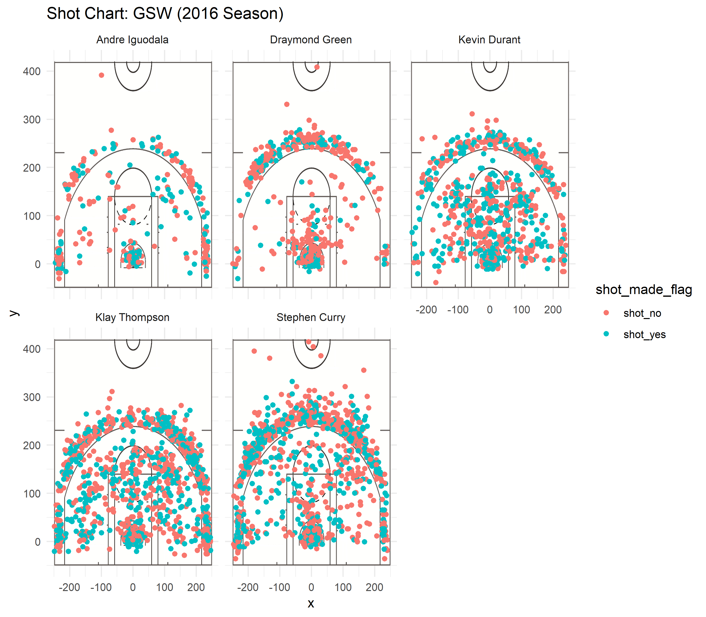

```{r setup, include=FALSE}
knitr::opts_chunk$set(echo = TRUE)
```
```{r, include=FALSE}
library(knitr)
```
```{r, include=FALSE}
library(readr)
library(dplyr)

#Import shots-data.csv
shots_chart <-read.csv("../data/shots-data.csv", stringsAsFactors = FALSE) 


#2PT Effective Shooting % by Player
two_pt_shot_chart <- shots_chart %>%
  group_by(name) %>%
  summarise(total = sum(shot_type == "2PT Field Goal"),
            made  = sum(shot_type ==  "2PT Field Goal" & shot_made_flag == "shot_yes" ),
            perc_made = made/total
            ) %>%
  arrange(desc(perc_made))

#3PT Effective Shooting % by Player
three_pt_shot_chart <- shots_chart %>%
  group_by(name) %>%
  summarise(total = sum(shot_type == "3PT Field Goal"),
            made  = sum(shot_type ==  "3PT Field Goal" & shot_made_flag == "shot_yes" ),
            perc_made = made/total
            ) %>%
  arrange(desc(perc_made))
  
#Effective Shooting % by Player
effective_shot_chart <- shots_chart %>%
  group_by(name) %>%
  summarise(total = length(shot_type),
            made  =  sum(shot_made_flag == "shot_yes") ,
            perc_made = made/total
            ) %>%
  arrange(desc(perc_made))
  
```


## **Is Andre Iguodala the best player on the Golden State Warriors team?**

### *Introduction:*

The Golden State Warriors in the modern day are *THE* super team having won the NBA finals in 2015, 2017 and 2018 accounting for 3 rings in the modern era (defined as beginning in 1998 following the Bulls' breakup).  Stephen Curry, Kevin Durant and Klay Thompson are the main Warriors often talked about as being the MVPs or most valuable players to the success of the Warriors, which makes sense because the Warriors came into dominance via Curry and Thompson's league breaking 3PT field goal shooting %. But...is it possible that Andre Iguodala (NBA Finals MVP, 2015) is actually the best and "most valuable" player to the recent success of the Warriors? Is he responsible for the Warriors Dynasty which has formed? 

### *Motivation:*
The Warriors get a lot of media coverage given that they're heralded as the best team in the NBA League by many people having won the championship in back to back years and look to "Three-Peat" in 2019 currently holding the #1 seed in the Western Conference. Stephen Curry and Kevin Durant get the bulk of this media attention and in general public opinion, are seen as the best or most valuable players on the team but is Andre Iguodala being overlooked or underappreciated? This report will seek to analyze this claim in regards to the value of Andre Iguodala to winning. 

### *Background:*
In the NBA, prolific scorers tend to get more media coverage and praise in general for fan votes and MVP discussions. Defense is often underrated and efficient but low scoring often tends to be overlooked. Andre Iguodala fits both of these descriptions of having good defense and low non flashy scoring. 


### *Discussion and Analysis:*
```{r, echo=FALSE}
kable(two_pt_shot_chart)
```
```{r, echo=FALSE}
kable(effective_shot_chart)
```

From this table, we can see that Andre Iguodala has the highest 2PT Field Goal percentage among the 5 starting Warriors with a sizable difference between him at 63.8% and Durant at 60.7% and Curry at 54.0% Looking at Effective Shooting % which includes both 2PT and 3PT field goals, Durant takes the lead at 54.1%, Iguodala at 51.8% and Thompson at 47.1%. From these numbers alone, it would appear that Iguodala is the most efficient 2PT Field Goal shooter and even surpassing Thompson and Curry by a fairly large margin in terms of total Effective Shooting %.

```{r, echo=FALSE}
kable(three_pt_shot_chart)
```

This argument is of course somewhat flawed however because the data fails to account for the fundamental difference in points between 2PT and 3PT Field Goals, that is 3PT Field Goal Shooting %s will naturally be lower because it is a more difficult shot but it is also rewarded with being worth 3 points rather than the typical 2. So while Iguodala has a higher Effective Shooting % than Curry and Thompson, this statistic doesn't necessarily say that he's a more efficient scorer than them because it fails to account for the difference in points earned. 

However, what these data points, in particular the shot chart, show is that Andre Iguodala has a very important role in the Warriors Offensive Scheme in that he is an efficient 2PT scorer as many of his 2PT shots are close to the rim, either a lay-up or dunk which have very high make %'s. Given that Curry, Thompson and Durant are very good shooters and very good 3PT shooters in particular, they can space the floor out drawing defenders out to the perimeter (marked by the 3PT line) allowing room in the Paint which allows Iguodala to outspeed defenders and get easier dunks or lay-ups which are again, almost a certain make for skilled finishers such as Iguodala.  

```{r, echo=FALSE}

```

Another crucial part of this argument which is not represented in the data here is defense. The shot chart and tables show efficiency of shots or offense for the main players on the Warriors team but it does not showcase any form of defensive rating or any indication towards defensive skill at all. A large part of Andre Iguodala's value comes from his stout defense. Looking at 2018, and drawing reference to [basketball-reference.com](https://www.basketball-reference.com/teams/GSW/2018/on-off/), the Warriors had a defensive rating of 104 when Iguodala was on the court versus 110.8 when he was not. This is shown in the table below but in summary, the Warriors actually had a better defensive rating with players such as Curry and Durant off the court than on the court. Some critics draw issue with defensive rating when used to compare players like this because it does not account for the quality of players which the compared players are defending. For example, Curry and Durant may be defending against higher quality players such as LeBron James or James Harden who are prolific scorers and Iguodala may be defending against bench players or what not. And while there may be some truth to this criticism, defensive rating when it has such a large disparity such as this, there can still be insight to be gleaned which is that Andre Iguodala provides very important defense to this Warriors' team. In fact, Andre Iguodala earned his NBA Finals MVP 2015 primarily off of defending LeBron James, one of the best players of all time. Iguodala held him to ["a net rating of minus-15.5 and ... a true shooting percentage of 46.4 percent, which skyrocketed to a net rating of plus-18.8 and 50.9 percent true shooting"](https://www.washingtonpost.com/news/fancy-stats/wp/2015/06/17/andre-iguodala-is-worst-nba-finals-mvp-in-last-30-years/?noredirect=on&utm_term=.d045db5e0000) when James was not defended by Iguodala. 
So, if anything, Iguodala tends to get the bulk of more difficult defensive jobs. 

###*Conclusion and Take-home message: *
So...while Iguodala is probably not the main reason for the Warriors dominance, he is still a very integral part of the Warriors team and is being criminally underrated and underappreciated by casual onlookers and fans who simply see the hot scoring of Curry, Thompson and Durant. Iguodala makes his presence known with thunderous (and efficient) dunks and there is good reason that he earned his NBA Finals MVP in 2015 defending one of the best players of all time, Lebron James. 

***


### *Code:*
```{r}
library(readr)
library(dplyr)

#Import shots-data.csv
shots_chart <-read.csv("../data/shots-data.csv", stringsAsFactors = FALSE) 


#2PT Effective Shooting % by Player
two_pt_shot_chart <- shots_chart %>%
  group_by(name) %>%
  summarise(total = sum(shot_type == "2PT Field Goal"),
            made  = sum(shot_type ==  "2PT Field Goal" & shot_made_flag == "shot_yes" ),
            perc_made = made/total
            ) %>%
  arrange(desc(perc_made))

#3PT Effective Shooting % by Player
three_pt_shot_chart <- shots_chart %>%
  group_by(name) %>%
  summarise(total = sum(shot_type == "3PT Field Goal"),
            made  = sum(shot_type ==  "3PT Field Goal" & shot_made_flag == "shot_yes" ),
            perc_made = made/total
            ) %>%
  arrange(desc(perc_made))
  
#Effective Shooting % by Player
effective_shot_chart <- shots_chart %>%
  group_by(name) %>%
  summarise(total = length(shot_type),
            made  =  sum(shot_made_flag == "shot_yes") ,
            perc_made = made/total
            ) %>%
  arrange(desc(perc_made))
  
```

## *Charts and Images and Data*

###**2PT Effective Shooting % by Player** *(code used shown below article)*


```{r}
kable(two_pt_shot_chart)
```


###**3PT Effective Shooting % by Player** *(code used shown below article)*

```{r}
kable(three_pt_shot_chart)
```


###**Effective Shooting % by Player** *(code used shown below article)*

```{r}
kable(effective_shot_chart)
```


***


